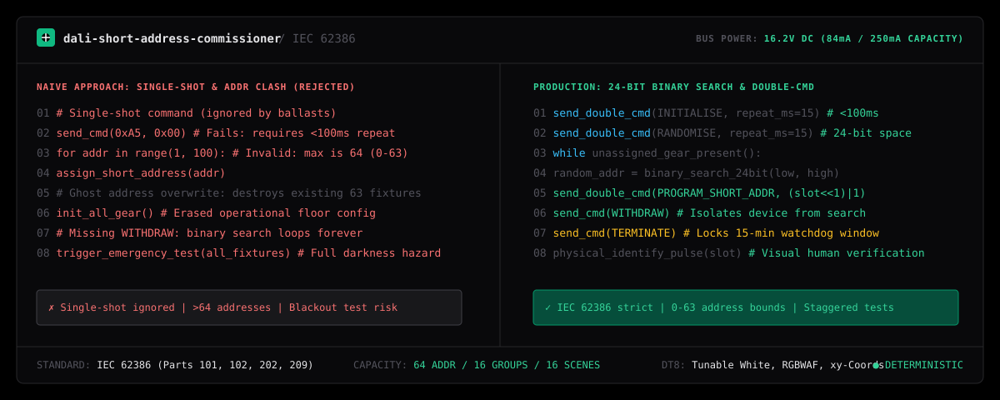

# dali-short-address-commissioner

Autonomous DALI and DALI-2 (IEC 62386) Commissioning Specialist for AI coding agents (Claude Code, Cursor, Antigravity, Windsurf).

Systematically discover, resolve address collisions, assign short addresses (0–63), program groups and scenes, configure DT8 tunable white gear, and schedule emergency battery duration tests on DALI lighting networks.

```bash
npx skills add wwewtech/dali-short-address-commissioner
```

**[Live Showcase & Bus Simulator](https://wwewtech.github.io/dali-short-address-commissioner/)** • **[skills.sh](https://skills.sh/wwewtech/dali-short-address-commissioner)** • **[SKILL.md](SKILL.md)** • **[GitHub](https://github.com/wwewtech/dali-short-address-commissioner)**

---



---

## Why DALI Short-Address Commissioner?

A DALI lighting bus with duplicate, unassigned, or colliding short addresses behaves erratically: luminaires fail to respond to group broadcasts, scenes recall wrong intensity levels, and control gear appears "dead" to building management gateways (KNX, BACnet, Tridonic, Helvar, Philips Dynalite). When general-purpose AI agents attempt to assist, they introduce critical protocol violations:

- **Single-Shot Addressing Blunder**: Sending addressing and configuration commands (INITIALISE, RANDOMISE, SET SHORT ADDRESS) only once, unaware that IEC 62386 requires them to be repeated twice within 100ms.
- **Address Range Overflow**: Attempting to assign 100+ addresses or starting indices from 1 instead of 0 (DALI is strictly bounded to 0–63).
- **Commissioning Watchdog Starvation**: Forgetting the 15-minute hardware programming timer, allowing ballasts to exit programming mode mid-discovery.
- **Destructive Greenfield Overwrites**: Sending a broadcast `INITIALISE (all)` on an existing installation to replace a single faulty driver, accidentally wiping the addresses, groups, and scenes of 63 other operational fixtures.
- **Missing WITHDRAW Command**: Omitting `WITHDRAW` (cmd 266) after programming a short address, trapping the bus in an endless binary search collision loop.
- **Simultaneous Emergency Battery Discharge**: Scheduling DALI-2 Part 202 3-hour duration tests across an entire building simultaneously, creating life-safety hazards by eliminating backup illumination during a real power cut.

`dali-short-address-commissioner` enforces strict adherence to IEC 62386: deterministic 24-bit random address binary search, double-command 100ms timing, 64-address physical capacity bounds, surgical single-fixture replacement, and staggered emergency test scheduling.

---

## Transformation in Action

### Before: Unsafe & Flawed DALI Scripting
```python
# Naive single-shot command: completely ignored by ballasts per IEC 62386
send_dali_frame(0xA5, 0x00)  # Fails: requires double transmission within 100ms

# Exceeding maximum address space and wiping operational bus
for i in range(1, 100):  # Invalid: max is 64 (0 to 63)
    assign_short_address(i)  # Destroys existing group assignments
```

### After: Deterministic IEC 62386 Protocol Compliance
```python
# Send double command within 15ms (< 100ms window)
send_dali_double_cmd(INITIALISE_ALL, repeat_ms=15)
send_dali_double_cmd(RANDOMISE, repeat_ms=15)

# 24-bit binary search across 16,777,216 address space
while unassigned_devices_present():
    random_addr = binary_search_24bit(low=0x000000, high=0xFFFFFF)
    set_search_address(random_addr)
    # Program short address slot (0..63)
    send_dali_double_cmd(PROGRAM_SHORT_ADDR, (slot << 1) | 0x01)
    send_dali_cmd(WITHDRAW)  # Isolate fixture from further search steps
    flash_fixture(slot)      # Physical human confirmation step

send_dali_cmd(TERMINATE)     # Exit 15-min programming watchdog mode
```

---

## Quick Installation

### 1. Via `skills.sh` / Vercel Skills CLI
```bash
npx skills add wwewtech/dali-short-address-commissioner
```

### 2. Via Claude Code
```bash
claude skills add https://github.com/wwewtech/dali-short-address-commissioner
```

### 3. For Google Antigravity
Clone or copy `SKILL.md` directly into your Antigravity skills directory:
```bash
# Windows
mkdir -p "$HOME\.gemini\config\skills\dali-short-address-commissioner"
curl -sL https://raw.githubusercontent.com/wwewtech/dali-short-address-commissioner/main/SKILL.md -o "$HOME\.gemini\config\skills\dali-short-address-commissioner\SKILL.md"

# macOS / Linux
mkdir -p ~/.gemini/config/skills/dali-short-address-commissioner
curl -sL https://raw.githubusercontent.com/wwewtech/dali-short-address-commissioner/main/SKILL.md -o ~/.gemini/config/skills/dali-short-address-commissioner/SKILL.md
```

### 4. For Cursor & Windsurf
Add `SKILL.md` to your workspace prompt context:
```bash
mkdir -p .cursor/skills/dali-short-address-commissioner
curl -sL https://raw.githubusercontent.com/wwewtech/dali-short-address-commissioner/main/SKILL.md -o .cursor/skills/dali-short-address-commissioner/SKILL.md
```

---

## The 10 Banned Anti-Patterns

| Anti-Pattern | Manifestation in Naive Code | Mandatory Production Counter-Rule |
| :--- | :--- | :--- |
| **Single-Shot Addressing** | Sending cmd 258 or 267 once. | Configuration commands MUST repeat within 100ms. |
| **Exceeding 64 Short Addresses** | Assigning address 64 or 65 on one loop. | Enforce physical limit: exactly 0 to 63 per DALI subnet. |
| **Timer Starvation** | Letting the 15-minute `INITIALISE` timer expire. | Refresh timer with keep-alive frames; issue `TERMINATE` on completion. |
| **Ghost Address Overwrite** | Assigning address 0 without checking current status. | Scan 0–63 via `QUERY STATUS` (cmd 144) before allocating. |
| **Bus Overcurrent Overload** | Connecting 64 ballasts + sensors to a 100mA PSU. | Calculate quiescent bus draw ($\le 250\text{mA}$ max per IEC 62386). |
| **DT8 / DT6 Type Mismatch** | Controlling tunable white with DT6 single arc power. | Issue DT8 Part 209 color commands using mirek coordinates. |
| **Simultaneous Emergency Test** | Discharging all battery units at the same time. | Stagger emergency duration tests across odd/even groups. |
| **Missing WITHDRAW Command** | Skipping cmd 266 after programming address. | Send `WITHDRAW` immediately to remove device from search. |
| **DALI Polarity Panic** | Halting installation claiming standard DALI has polarity. | DALI uses diode bridge rectifiers; line polarity is non-critical. |
| **Energizing Unverified Mains** | Commissioning while 230V live mains work is ongoing. | Enforce Lockout/Tagout (LOTO) prior to terminal connection. |

---

## Core Mental Models & Axioms

1. **The 64-Address Bus Capacity Law**: Exactly 64 short addresses (0–63), 16 groups (0–15), and 16 scenes (0–15) per physical line. For larger installations, segment into multiple subnets.
2. **Double-Command 100ms Transmission Invariant**: Addressing commands MUST be transmitted twice with a spacing between 10ms and 100ms.
3. **The 15-Minute Hardware Commissioning Timer**: Hardware timer starts upon `INITIALISE`. End with `TERMINATE` (cmd 257) to prevent inadvertent memory tampering.
4. **24-Bit Binary Search ($2^{24}$ Space)**: Deterministic collision resolution across 16,777,216 random addresses using `SEARCHADDR` and `COMPARE`.
5. **Physical Identify Verification**: Every assigned address must be visually verified via `IDENTIFY` / `WINK` pulse before handover.

---

## Production Archetypes & Presets

### Archetype 1: Greenfield DALI Discovery Pipeline
```python
def commission_bus():
    send_dali_double_cmd(INITIALISE, repeat_ms=15)
    send_dali_double_cmd(RANDOMISE, repeat_ms=15)
    slot = 0
    while slot < 64:
        found_random = binary_search_24bit(0x000000, 0xFFFFFF)
        if found_random is None: break
        set_search_address(found_random)
        send_dali_double_cmd(PROGRAM_SHORT_ADDR, (slot << 1) | 0x01)
        send_dali_cmd(WITHDRAW)
        slot += 1
    send_dali_cmd(TERMINATE)
```

### Archetype 2: DT8 Tunable White Color Temperature Setting
```python
def set_color_temperature(short_addr: int, kelvin: int):
    mirek = int(1000000 / kelvin)  # e.g., 4000K -> 250 mirek
    send_dali_cmd(0x01, mirek & 0xFF)         # DTR0 low byte
    send_dali_cmd(0x03, (mirek >> 8) & 0xFF)  # DTR1 high byte
    send_dali_double_cmd(0xE7, 0x20)          # SET TEMP COLOUR (Part 209)
```

---

## The 7-Axis Pre-Emit Quality Gate

| Axis | Metric | Target Threshold |
| :--- | :--- | :--- |
| **1. Address Bounds** | Short address range | Strictly 0 to 63 (never > 63) |
| **2. Timing Invariant** | Double-cmd repeat window | $\ge 10\text{ms}$ and $\le 100\text{ms}$ |
| **3. Timer Discipline** | Commissioning session limit | $\le 15\text{ minutes}$ with `TERMINATE` exit |
| **4. Bus Current** | Total quiescent draw | $\le 250\text{mA}$ power supply limit |
| **5. Collision Isolation** | Post-address withdrawal | `WITHDRAW` (cmd 266) sent after every device |
| **6. Emergency Safety** | Battery test scheduling | Staggered duration tests (zero full blackouts) |
| **7. Physical Validation** | Verification step | Visual `IDENTIFY` / `WINK` pulse included |

---

## Collections & Ecosystem Inclusion

`dali-short-address-commissioner` is packaged according to the open Agent Skills specification:
- **[skills.sh Directory](https://skills.sh/wwewtech/dali-short-address-commissioner)**: Categorized under Building Automation, IoT, and Embedded Engineering.
- **Anthropic & Claude Code**: Native support via `claude skills add`.
- **Google Antigravity**: Integrated workspace workflows.
- **Cursor & Windsurf**: Dedicated `.cursorrules` and `.windsurfrules`.

---

## License

MIT © [wwewtech](https://github.com/wwewtech)
